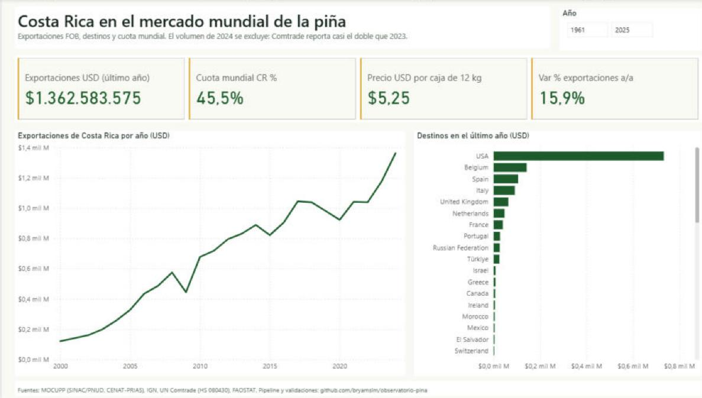

# Observatorio de la piña · Costa Rica

Datos públicos del sector piñero costarricense, desde el satélite hasta el puerto, en un
modelo estrella de **SQL Server** y un reporte de **Power BI** de cinco páginas.

**En vivo:** [observatorio.bryamlopez.com](https://observatorio.bryamlopez.com) ·
**Reporte:** [`powerbi/Observatorio.pbix`](powerbi/Observatorio.pbix) y su versión como código
en [`powerbi/`](powerbi/)



## Qué responde

| Pregunta | Fuente | Respuesta (verificada) |
|---|---|---|
| ¿Cuánto exporta Costa Rica y a dónde? | UN Comtrade, HS 080430 | USD 1.362.583.575 en 2024 (+15,9 % contra 2023). Estados Unidos recibe el 53,8 %. |
| ¿Qué peso tiene en el mundo? | UN Comtrade | 53,7 % de las exportaciones mundiales en 2024. Es el primer exportador. |
| ¿Dónde está la piña? | MOCUPP + IGN | 65.442 ha en 2019. El 67,4 % está en Huetar Norte. Pital es el distrito con más piña (7.559 ha). |
| ¿Cuánto creció? | MOCUPP | De 13.304 ha en 2000 a 65.442 ha en 2019. En Pocosol pasó de 51 a 1.991 ha. |
| ¿Cuánto bosque se convirtió en piña? | MOCUPP | 6.858 ha entre 2000 y 2019: 5.624 en 2000-2015 y 89 en 2018-2019. |
| ¿Qué tan productiva es? | FAOSTAT | 58,8 t/ha en 2024 contra 28,2 t/ha del promedio mundial. 3.118.093 t producidas. |

## Arquitectura

```
FUENTES                      INGESTA               ALMACÉN                    MODELO              CONSUMO
MOCUPP piña (WFS CENAT)  ─┐                        SQL Server 2022 (T-SQL)
IGN límites (WFS SNIT)   ─┤  descargar.py          dw.*   datos públicos       Power BI            Reporte .pbix
UN Comtrade (API)        ─┼─ procesar.py      ──►  ops.*  operación         ─► 15 tablas,      ─► observatorio.
FAOSTAT (bulk)           ─┤  (reproyección,        vistas v_* de KPI           38 medidas DAX,     bryamlopez.com
Operación SIMULADA       ─┘   cruce espacial)      login de solo lectura       PBIP como código
(simular_operacion.py)
```

- **Almacén:** SQL Server 2022 Developer en un contenedor del servidor. Escucha solo en `localhost`
  y se accede por túnel SSH. Es el mismo motor sobre el que corre Microsoft Business Central.
- **Modelo estrella:** dimensiones `Año`, `Distrito`, `País`, `Fecha`, `Bloque`, `Ciclo`. Hechos de área,
  cambio de cobertura, exportaciones de Costa Rica, exportaciones mundiales, producción, cosecha,
  labores y ventas. El detalle está en [`docs/arquitectura.md`](docs/arquitectura.md).
- **Reporte como código:** `scripts/generar_pbip.py` escribe el modelo semántico (TMDL) y las páginas
  (PBIR). Cada medida DAX y cada visual se pueden revisar en un diff.

## Las cinco páginas

| Página | Qué muestra |
|---|---|
| 1 · Mercado | Exportaciones por año, destinos, precio implícito por caja de 12 kg, cuota mundial, variación anual |
| 2 · Territorio | Hectáreas por medición y por distrito, peso de Huetar Norte, crecimiento 2000-2019 |
| 3 · Sostenibilidad | Bosque convertido en piña por periodo y por distrito |
| 4 · Productividad | Rendimiento de Costa Rica contra el mundo, mayores productores |
| 5 · Operación (**simulada**) | Cajas/ha por ciclo, % exportable, costo por caja, margen de campo, presupuesto contra real por bloque y labor |

La página 5 usa **datos simulados**: no son de ninguna empresa. Tienen la forma de lo que registran
un sistema de gestión agrícola (labores y costos por bloque) y un ERP (ventas por embarque).
Dos parámetros están calibrados con referencias reales:
- **Precio:** USD 6,74 por caja, a partir del precio implícito de Comtrade 2023 (USD 0,556/kg × 12 kg).
- **Costo de campo:** unos ₡4,6 M/ha por ciclo, cerca de la referencia del MAG de
  [USD 9.057/ha](https://www.mag.go.cr/bibliotecavirtual/e70-10277.pdf). No verifiqué de qué año es esa cifra.

## Controles contra cifras oficiales

| Control | Calculado | Publicado |
|---|---|---|
| Área de piña 2015 | 58.427 ha | 58.426,11 ha ([MOCUPP](https://mocupp.org/cultivo-pina/)) |
| Área de piña 2018 | 65.671 ha | 65.671 ha (MOCUPP) |
| Pérdida de bosque 2017-2018 | 343 ha | "más de 343 ha" (MOCUPP) |
| Peso de Huetar Norte | 67,4 % | 67 % (MOCUPP) |
| Producción CR 2024 | 3.118.093 t | 3.118.093 t (FAOSTAT) |
| Área de piña 2016 | 5.959 ha | 68.643 ha → **capa incompleta, excluida** |

Los controles corren solos al final de `cargar.py`.

## Errores encontrados en las fuentes

Están documentados en [`docs/calidad-de-datos.md`](docs/calidad-de-datos.md):

1. **Sistema de coordenadas mal declarado.** El WFS de MOCUPP dice EPSG:4326, pero las coordenadas
   están en CRTM05 (EPSG:5367). Sin corregirlo, el área da 0 ha.
2. **Capa de 2016 incompleta.** Trae 298 polígonos y 5.959 ha.
3. **`CÓDIGO` del IGN no es único.** Chomes y San Juan de Abangares comparten el 160105. La llave
   correcta es `CÓDIGO_DTA`.
4. **Rótulos que cambian cada año** en los cambios de cobertura de MOCUPP.
5. **Comtrade 2025 incompleto.** Costa Rica no reporta todavía, así que 2025 no se usa en comparaciones.
6. **Volumen de 2024 en Comtrade.** 4.047 mil t contra 2.114 mil t en 2023, con un valor que solo sube 16 %.
   Se excluye del precio por kg.
7. **Nombres históricos en Comtrade** ("India (...1974)") y en inglés. Se normalizan y se traducen al español.

## Cómo correrlo

```bash
python -m pip install -r requirements.txt
cp .env.example .env                 # completar las contraseñas
ssh -f -N -L 14333:127.0.0.1:14333 bryam   # túnel al SQL Server

python scripts/descargar.py          # fuentes crudas a data/raw (idempotente)
python scripts/procesar.py           # modelo estrella a data/clean
python scripts/simular_operacion.py  # operación simulada (semilla fija)
python scripts/cargar.py             # SQL Server + controles
python scripts/generar_pbip.py       # reporte de Power BI como código
python scripts/exportar_web.py       # datos de la página web
```

Para abrir el reporte en Power BI Desktop: **Archivo → Abrir → `powerbi/Observatorio.pbip`** (o el `.pbix`).
En las credenciales de SQL Server, elegí **Base de datos** y usá el usuario `observatorio_bi`.

## Estructura

```
scripts/   descargar · procesar · simular_operacion · cargar · generar_pbip · exportar_web
sql/       schema.sql (dw: datos públicos) · schema_ops.sql (ops: operación simulada)
data/clean CSV del modelo estrella (data/raw no se versiona)
powerbi/   Observatorio.pbip (TMDL + PBIR) y Observatorio.pbix
web/       página pública (HTML estático + datos.json)
docs/      arquitectura · calidad de datos · capturas
```

## Límites

- MOCUPP publica piña hasta 2019. No hay una medición satelital oficial más reciente.
- Comtrade da valores anuales. El detalle mensual está en el portal de PROCOMER, que solo
  exporta a Excel a mano, y quedó fuera.
- La página de operación es una **simulación** y no describe a ninguna finca real.

---

Hecho por [Bryam López](https://linkedin.com/in/bryamslm), ingeniero en Computación (TEC).
